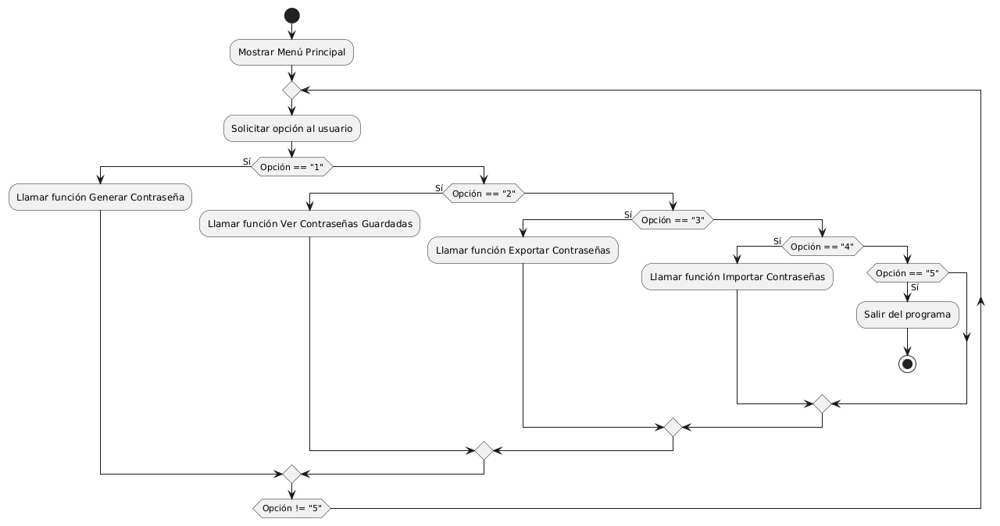
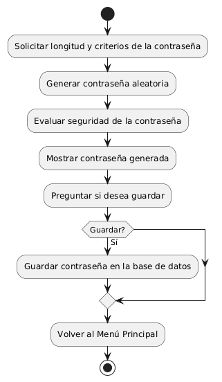
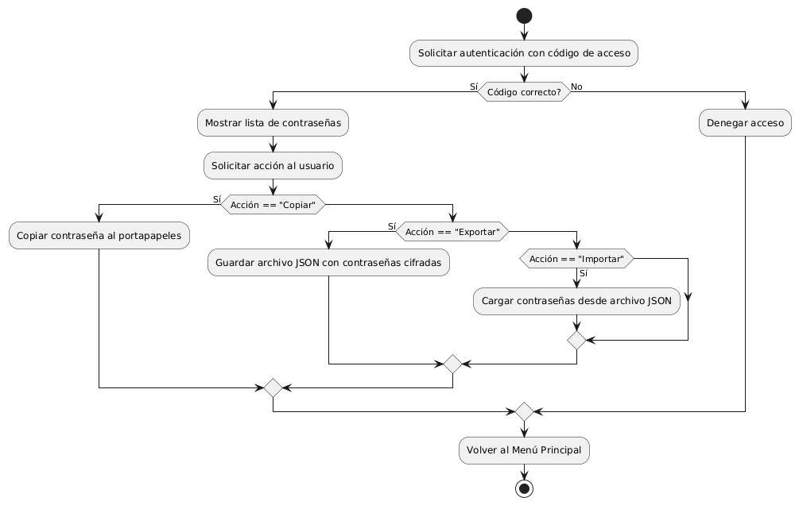

🔐 Generador de Contraseñas Seguras - UIDE
📌 Versión Final - Última actualización: 02 de marzo del 2025
📌 Desarrollado por: Luis Eduardo Valero Alvarado
📌 Repositorio GitHub: 🔗 (https://github.com/Levaedu77/Generador-Contrasenas-UIDE)

📌 Descripción del Proyecto
Este proyecto es un generador de contraseñas seguras desarrollado en Python. Permite crear, almacenar y gestionar contraseñas con opciones de seguridad avanzadas.

El software integra:
✔️ Generación de contraseñas con configuraciones personalizadas (mayúsculas, números, símbolos).
✔️ Almacenamiento seguro de contraseñas en un archivo cifrado.
✔️ Visualización y copia rápida de contraseñas guardadas.
✔️ Exportación e importación de contraseñas en formato JSON.
✔️ Seguridad reforzada con autenticación de acceso.

🎯 Objetivo del Programa
El objetivo principal de este software es facilitar la creación y gestión de contraseñas seguras, proporcionando una herramienta funcional que evite contraseñas débiles o repetidas, mejorando la seguridad de los usuarios.

⚙️ Tecnologías Utilizadas
🟢 Lenguaje: Python 3.13.2
📦 Librerías: pyperclip (copiar contraseñas) y tabulate (formato de tablas).

🛠️ Estructura del Proyecto
📂 Generador-Contrasenas-UIDE/
├── 📂 docs/ – Contiene la documentación y los diagramas del proyecto.
├── 📂 src/ – Directorio principal del código fuente.
│ ├── 📂 logic/ – Módulo encargado de la generación de contraseñas.
│ ├── 📂 storage/ – Módulo para el almacenamiento de contraseñas.
│ ├── 📂 ui/ – Interfaz en línea de comandos (CLI).
│ ├── init.py – Archivo para convertir src en un paquete de Python.
│ ├── main.py – Archivo principal que ejecuta el programa.
├── .gitignore – Define los archivos y carpetas a excluir en Git.
├── README.md – Documentación introductoria y detalles del proyecto.
├── requirements.txt – Lista de librerías necesarias para el funcionamiento.
├── contraseñas.json – Archivo donde se almacenan las contraseñas generadas.

📜 Diagramas del Proyecto
Estos diagramas representan el flujo y la arquitectura del proyecto:

## 📜 Diagramas del Proyecto  

### 📌 Diagrama de Flujo - Menú Principal

### 📌 Diagrama de Flujo - Generar Contraseña

### 📌 Diagrama de Flujo - Gestión de Contraseñas Guardadas

### 📌 Casos de Uso

### 📌 Arquitectura del Sistema

🚀 Ejecución del Programa
Para ejecutar la aplicación en PowerShell o Git Bash, usa el siguiente comando:
  bash
  python -m src.ui.main

Esto iniciará el programa con el menú principal.

📌 Funcionalidades Principales
✅ Generar Contraseñas Seguras → Personalización de longitud y tipo de caracteres.
✅ Guardar Contraseñas → Almacenamiento seguro en JSON cifrado.
✅ Ver y Copiar Contraseñas Guardadas → Acceso rápido y seguro.
✅ Exportar e Importar Contraseñas → Para respaldo y restauración de datos.
✅ Acceso Seguro → Protección con autenticación al visualizar contraseñas.

🔐 Seguridad del Software
✔️ Autenticación: Se requiere una clave maestra para ver contraseñas guardadas.
✔️ Formato JSON cifrado: Se almacenan contraseñas de manera segura.
✔️ Limpieza automática: Opción para eliminar contraseñas antiguas.

🏆 Conclusión
Este generador de contraseñas cumple con los requisitos de la materia Lógica de Programación y se alinea con buenas prácticas de seguridad informática. Con esta aplicación, los usuarios pueden crear y gestionar contraseñas de manera eficiente y segura.

📚 Referencias Bibliográficas 
Python Software Foundation. (2025). Python 3.13 Documentation. https://docs.python.org/3/
GitHub Docs. (2025). Getting Started with GitHub. https://docs.github.com/
PlantUML. (2025). PlantUML Documentation. https://plantuml.com/
