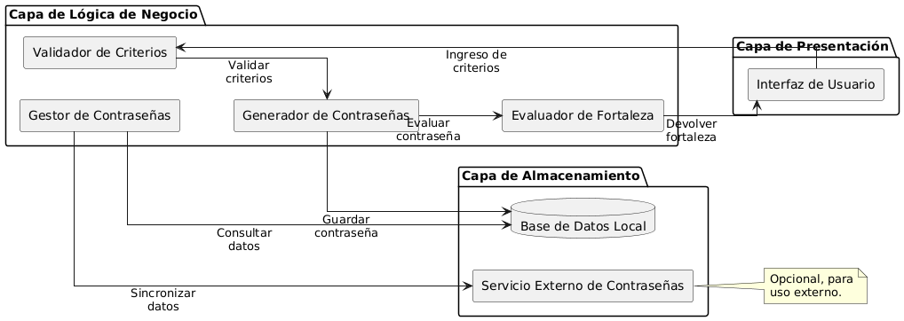

# Generador de Contraseñas Seguras 🔒

Este es un proyecto en Python que genera contraseñas seguras basadas en diferentes parámetros.

## 📂 Estructura del Proyecto
- `/docs`: Contiene los diagramas de flujo y arquitectura.
- `/src`: Contiene el código fuente del generador de contraseñas.

## 🚀 Cómo ejecutar el código
1. Clona el repositorio:

## 📊 Diagramas del Proyecto

### 🔹 Diagrama de Casos de Uso

### 🔹 Arquitectura del Sistema

